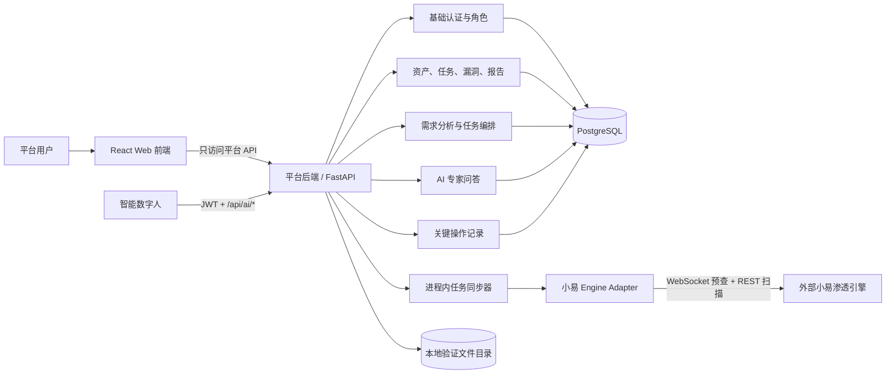
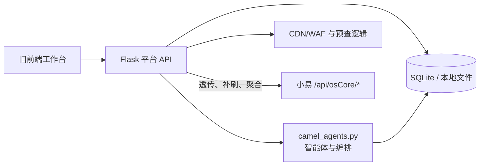
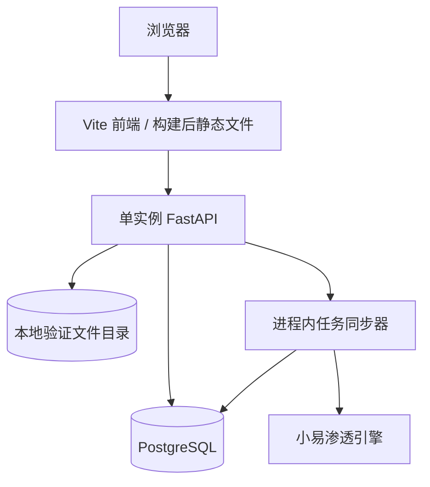
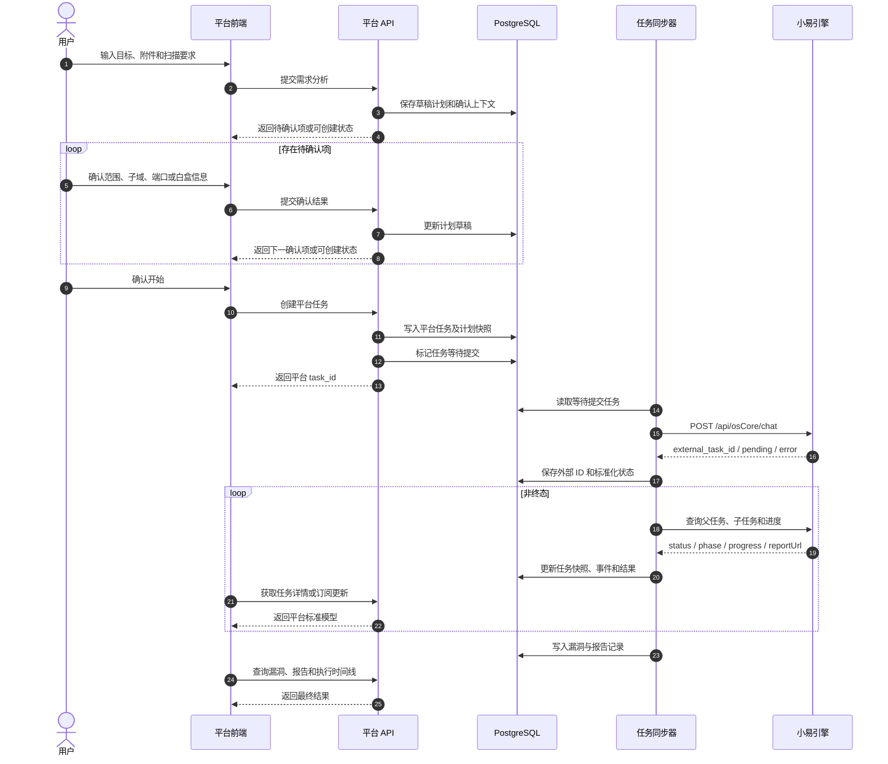
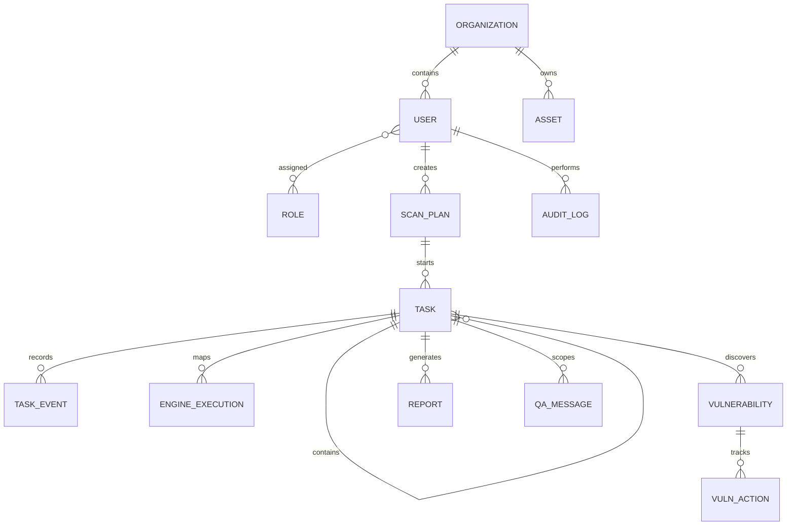

# AI 安服平台可验证模型开发确认文档（详细版）

| 项目 | 内容 |
| --- | --- |
| 文档状态 | 可验证模型方案，待评审 |
| 版本 | v0.3 |
| 日期 | 2026-07-17 |
| 适用范围 | AI 安服平台全系统可验证模型 |
| 评审对象 | 产品、前端、后端、算法/智能体、扫描引擎、测试、运维、安全 |

> 本文档用于确认开发边界与技术方案，不是最终接口手册。标记为“待确认”的内容，在相关负责人确认前不得作为既定事实进入开发。

## 评审摘要

建议本次会议先确认以下结论：

1. 本期交付可运行的全系统验证模型，不是单纯前端，也不是商用发布版本。
2. 平台负责全部业务、数据、权限和任务编排；小易提供渗透计算，数字人提供分析和结构化结果回传。
3. 前端只调用平台 API；平台通过统一适配器调用小易。
4. 验证栈采用 React、FastAPI、PostgreSQL、进程内任务同步器和本地文件存储。
5. 本期只完成一条真实、可重复演示的业务闭环，不为高并发和高可用提前建设。

启动渗透主链路开发前，必须确认 WebSocket V1.4.2 的版本优先级、小易工具结果接口、数字人结果归属、报告规则、并发与超时限制。完整清单见第 14、15 节。

## 0. 最新接口结论

本节依据《WebSocket 对接设计方案 V1.4.2》和《数字人对接文档》补充；如与旧 `/chat` 预查描述冲突，以本节为准。

### 0.1 资产预查

- 子域和端口预查改用 `ws(s)://{host}/api/osCore/ws/asset-can`。
- 用户通过按钮主动触发；需要两类预查时固定“先子域、后端口”。
- WebSocket 只发送 `action` 与 `domains`/`hosts`，不发送用户、组织、白盒和扫描参数。
- 用户完成勾选后，平台只调用一次 `POST /api/osCore/chat`。
- 最终 `/chat` 使用确定后的 `asset_list`；`scan_*` 和 `can_*` 字段已废弃并会导致 400。
- 新平台由 FastAPI 代理上游 WebSocket，浏览器仍只连接平台。

### 0.2 智能数字人

数字人是带 JWT 调用平台 API 的外部系统，不是小易的一部分。现有契约包括：

| 能力 | 接口 |
| --- | --- |
| 登录 | `POST /api/auth/login` |
| 创建计划 | `POST /api/ai/create-test-plan` |
| 启动计划 | `POST /api/ai/start-test-plan` |
| 上传资产 | `POST /api/ai/upload-asset` |
| 上传漏洞 | `POST /api/ai/upload-vulnerability` |
| 上传报告 | `POST /api/ai/upload-report` |
| 上传日志 | `POST /api/ai/upload-log` |

验证模型使用独立数字人账号。上传数据必须校验并关联有效 `plan_id`；数据库是事实来源，不沿用旧实现中的 `current_test_data` 内存状态。

## 1. 项目目标

建设一套可独立运行、可连接真实小易引擎的全系统验证模型，用于验证产品流程、系统边界、接口契约和核心数据模型是否成立。

平台仍拥有自己的用户、资产、任务、漏洞、报告和操作记录；实际的子域探测、端口探测、扫描、漏洞验证及报告计算由外部“小易”渗透引擎执行。本期只要求形成端到端闭环，不要求达到商用系统的容量、可靠性和合规水平。

### 1.1 本期建设范围

- 基础登录、平台总览、任务、漏洞、报告和 AI 渗透工作台。
- 最小用户和角色模型，用于验证页面与 API 的访问控制。
- 资产录入、基础校验和扫描范围管理。
- 扫描需求分析、多轮确认、计划生成和任务编排。
- 小易引擎任务创建、状态同步、停止、结果接收及异常处理。
- 父任务、子任务、进度、阶段、时间线和工具执行结果。
- 漏洞结果入库、基础处置状态、报告记录与下载。
- AI 专家问答及任务范围内的历史记录。
- 数字人登录、计划联动及资产/漏洞/报告/日志回传。
- 关键操作日志、核心流程测试和可重复启动方式。

### 1.2 不属于平台的能力

- 平台不自行实现扫描器、漏洞利用器或渗透计算引擎。
- 平台不直接控制引擎内部 MCP 工具和算法实现。
- 前端不直接访问小易接口，也不保存小易访问凭据。
- 本期不建设微服务、Kubernetes、多活、自动扩缩容或复杂事件总线。
- 本期不承诺商用级 SLA、海量并发、无停机升级和跨区域容灾。
- 本期不建设企业 SSO、复杂多租户、细粒度数据权限和合规审计中心。
- 本期不做旧系统全量数据迁移、完整运营配置中心和可视化低代码能力。
- 4A 审计仅在其属于本轮核心验证目标时实施，否则保留入口和接口边界。

### 1.3 本期验证假设与通过标准

| 编号 | 要验证的假设 | 通过标准 |
| --- | --- | --- |
| H01 | 平台能隔离前端与小易差异 | 前端全程只使用平台任务 ID 和平台状态 |
| H02 | 需求分析和确认链可转化为有效扫描参数 | 子域、端口或白盒确认后能成功创建真实任务 |
| H03 | 平台能持续解释引擎执行过程 | 可展示父子任务、阶段、进度、当前工具和异常 |
| H04 | 引擎结果能沉淀为平台业务数据 | 至少生成漏洞记录或报告记录，并可从历史任务回查 |
| H05 | 核心产品流程可被真实用户理解 | 用户无需开发人员修改数据库即可完成一次任务 |
| H06 | 失败路径可控 | 引擎不可用、参数错误和停止任务均有明确页面反馈 |

本期验收以“一条真实任务黄金路径 + 必要失败路径”通过为准，不以页面数量、并发指标或生产运维能力作为主要验收条件。

## 2. 已确认的系统边界



系统边界原则：

1. 平台后端是前端唯一业务入口。
2. PostgreSQL 是验证模型的业务状态来源。
3. 小易任务 ID 只作为外部关联 ID，不能替代平台任务 ID。
4. 小易返回必须经过字段映射、状态标准化和权限过滤。
5. 引擎不可用时，平台的用户、资产、历史任务、漏洞和报告仍可查询。
6. 任务创建、停止、漏洞处置和报告下载记录最小操作日志。
7. 数字人是受认证的外部调用方，其结果必须绑定平台计划并经过字段校验。

## 3. 旧架构概述

旧架构已经形成“平台层 + 小易引擎”的基本边界：



旧架构的有效设计：

- 前端统一调用平台 API，不直连小易。
- `/api/xiaoyi/*` 表达平台业务，`/api/osCore/*` 表达引擎能力。
- 正式建任务前进行需求分析、范围确认和最终校验。
- 本地保存计划、任务、问答历史及部分运行状态。
- 支持父任务、子任务、任务组和单目标视角。
- 专家问答历史与扫描执行时间线相互独立。
- 4A 审计与普通扫描采用独立状态链。

旧架构的主要问题：

- Flask、智能体编排和业务接口耦合较深，模块边界不清晰。
- SQLite 与本地文件不适合多用户并发、可靠迁移和统一备份。
- 部分任务组聚合由前端完成，产生大量轮询和复杂状态。
- 引擎字段可能直接渗透到页面，升级引擎时影响范围过大。
- 本地状态、缓存状态和引擎状态之间缺少明确的事实来源。
- 接口文档、实际能力和旧流程图存在少量不一致。
- 权限、操作记录、故障恢复和监控尚未形成统一规范。

## 4. 新架构方案

### 4.1 架构风格

采用“前后端分离 + 模块化单体 + 进程内任务同步器 + 外部引擎适配器”。

任务同步器随 FastAPI 进程启动，定期同步非终态任务；服务重启后从 PostgreSQL 恢复同步。验证阶段只运行一个 API 实例，避免重复调度。只有验证结果证明并发或可靠性不足时，才升级为 Redis + 独立 Worker。

### 4.2 平台后端模块

| 模块 | 主要职责 | 是否调用小易 |
| --- | --- | --- |
| Identity | 基础登录、会话和角色 | 否 |
| Asset | 资产录入、导入、分组、去重、授权范围 | 否 |
| Scan Plan | 需求分析、草稿计划、多轮确认、计划快照 | 间接 |
| Task | 平台任务、父子任务、状态、进度、停止、重试 | 是 |
| Engine Adapter | 鉴权、请求映射、状态转换、超时和错误分类 | 是 |
| Vulnerability | 漏洞标准化、证据、等级、处置、复测 | 读取引擎结果 |
| Report | 报告元数据、归档、下载授权和版本 | 读取引擎报告 |
| Expert QA | 专家问答、上下文、范围隔离和历史 | 可使用任务上下文 |
| 4A Audit | 可选验证模块；文件分析、结果和 AI 复测 | 否 |
| Dashboard | 指标、趋势、风险和任务统计 | 否 |
| Audit Log | 关键操作、结果和调用人记录 | 否 |

### 4.3 部署结构



开发和演示环境使用 Docker Compose 启动前端、API 与 PostgreSQL。验证阶段不设计生产部署拓扑。

## 5. 核心业务流程

### 5.1 从需求分析到扫描完成



### 5.2 状态所有权

平台使用自己的状态枚举，不让页面依赖小易原始枚举。

| 平台状态 | 可能的小易状态 | 说明 |
| --- | --- | --- |
| `DRAFT` | 无 | 计划尚未创建任务 |
| `AWAITING_CONFIRMATION` | 平台预查交互状态 | 等待用户勾选 WebSocket 预查结果 |
| `QUEUED` | `WAITING`、`PENDING`、`DISPATCHING` | 已创建，等待执行 |
| `RUNNING` | `IN_PROGRESS` | 正在执行 |
| `PARTIAL_SUCCEEDED` | `PARTIAL_COMPLETED` | 部分子任务成功 |
| `SUCCEEDED` | `COMPLETED` | 执行完成 |
| `FAILED` | `FAILED`、`TIMEOUT` | 执行失败 |
| `CANCELLING` | 停止请求已发送 | 等待引擎确认 |
| `CANCELLED` | `STOPPED` | 已停止 |

阶段 `INIT → INFO_COLLECTING → SCANNING → EXPLOITING → REPORT_GENERATING → FINISHED` 作为执行阶段，不与任务状态混用。

## 6. 数据模型边界

首期核心实体如下：



约束：

- 平台主键使用 UUID；小易 ID 存入 `external_task_id` 并建立唯一索引。
- 创建任务时保存不可变的扫描计划快照，后续修改资产不影响历史任务。
- 状态变化以 `task_event` 追加记录，任务表只保存当前快照。
- 漏洞保留来源任务、资产、证据、严重度、处置状态和复测记录。
- 报告表保存元数据和本地归档路径，不直接依赖小易临时 URL。
- 验证模型至少在 API 层执行角色检查，不能只依靠前端隐藏入口。

## 7. API 分层

### 7.1 前端调用的平台 API

建议使用 `/api/v1` 作为平台 API 前缀：

| 领域 | 示例 |
| --- | --- |
| 身份 | `/api/v1/auth/*`、`/api/v1/users/*`、`/api/v1/roles/*` |
| 资产 | `/api/v1/assets/*` |
| 计划 | `/api/v1/scan-plans/*` |
| 任务 | `/api/v1/tasks/*`、`/api/v1/tasks/{id}/children` |
| 漏洞 | `/api/v1/vulnerabilities/*` |
| 报告 | `/api/v1/reports/*` |
| 专家问答 | `/api/v1/tasks/{id}/qa/*` |
| 4A 审计 | `/api/v1/4a-audits/*` |
| 总览 | `/api/v1/dashboard/*` |

### 7.2 后端调用的小易 API

| 场景 | 当前引擎接口 |
| --- | --- |
| 资产预查 | `WS /api/osCore/ws/asset-can` |
| 创建扫描任务 | `POST /api/osCore/chat` |
| 查询父任务或子任务 | `GET /api/osCore/task/{taskId}` |
| 查询批次子任务 | `GET /api/osCore/segment-task/{taskId}/children` |
| 停止任务 | `POST /api/osCore/task/{taskId}/stop` |
| 查询工具结果 | 旧文档记载 `/task/{taskId}/tools`，现 API 文档未定义，待确认 |

### 7.3 数字人调用的平台接口

平台保留 `/api/ai/*` 兼容入口，由数字人使用独立 JWT 调用。创建/启动计划必须复用平台内部的计划与任务用例；上传资产、漏洞、报告和日志必须写入 PostgreSQL，不能维护第二套内存状态。

Engine Adapter 必须负责：

- 请求与响应 DTO 映射。
- 连接超时、读取超时和有限次数重试。
- 幂等控制，防止重复创建扫描任务。
- 状态、阶段和错误码转换。
- 原始响应脱敏后留存，便于排障。
- 熔断或复杂流量治理首期不实现，确认出现实际故障模式后再增加。

## 8. 技术栈建议

### 8.1 前端

| 类别 | 选择 | 用途 |
| --- | --- | --- |
| 基础 | React + TypeScript + Vite | SPA、类型约束和构建 |
| 路由 | React Router | 页面路由与权限入口 |
| UI | Ant Design + CSS Variables | 企业后台组件和主题 |
| 服务端状态 | TanStack Query | 请求、缓存、轮询和失效 |
| 表单校验 | React Hook Form + Zod | 复杂扫描计划表单 |
| 图表 | Apache ECharts | 总览、趋势和风险图表 |
| 单元测试 | Vitest + Testing Library | 组件和纯逻辑测试 |
| 端到端测试 | Playwright | 核心业务流程 |

首期不引入 Axios 和全局状态框架。优先使用原生 `fetch`、TanStack Query 和局部状态；只有出现明确的跨页面客户端状态后再评估 Zustand。

### 8.2 后端

| 类别 | 选择 | 用途 |
| --- | --- | --- |
| Web 框架 | Python 3.12 + FastAPI | 平台 REST API |
| 数据模型 | Pydantic | 入参、出参和配置校验 |
| ORM/迁移 | SQLAlchemy 2 + Alembic | PostgreSQL 访问与迁移 |
| 数据库 | PostgreSQL 16 | 验证业务数据和任务恢复 |
| 任务同步 | `asyncio` 后台循环 | 引擎提交、轮询和报告归档 |
| 文件存储 | 本地受控目录 | 附件、证据和报告 |
| 测试 | pytest | 单元和集成测试 |

验证阶段只运行一个 API 实例。出现多实例部署、任务吞吐或可靠性需求后，再将同步器替换为 Celery + Redis；文件需要跨实例共享或生命周期管理时，再迁移到 MinIO/S3。

### 8.3 接入与部署

| 类别 | 选择 |
| --- | --- |
| 本地启动 | Vite + Uvicorn |
| 可重复演示 | Docker Compose |
| API 契约 | OpenAPI，由 FastAPI 自动生成 |
| 日志 | Python 标准日志 |
| 健康检查 | `/health` |
| CI | 格式检查、核心测试和前端构建 |

验证模型只需提供 `.env.example` 和启动说明；真实密钥不得提交到仓库。

## 9. 新旧架构对比

| 对比项 | 旧架构 | 新架构建议 | 收益 |
| --- | --- | --- | --- |
| 架构形态 | Flask 应用 + 脚本式编排 | 模块化单体 + 进程内同步器 | 最短路径验证边界 |
| 前端 | 旧工作台，部分聚合逻辑较重 | React + TypeScript | 统一组件和类型模型 |
| 平台 API | `/api/xiaoyi/*` 与旧模块耦合 | `/api/v1/*` 领域 API | 对前端提供稳定契约 |
| 引擎接入 | 业务代码中透传或补刷 | 集中 Engine Adapter | 隔离引擎变化 |
| 数据库 | SQLite / 本地文件 | PostgreSQL | 并发、事务、迁移和备份 |
| 异步执行 | 本地异步逻辑 | 单实例后台同步循环 | 无新增队列基础设施 |
| 任务状态来源 | 本地与引擎边界不够明确 | PostgreSQL 保存平台状态 | 可回查、可恢复同步 |
| 任务组聚合 | 部分由前端逐项轮询 | 后端同步并聚合 | 降低前端复杂度和请求量 |
| 文件与报告 | 本地文件或引擎 URL | 受控本地目录归档 | 足以验证下载闭环 |
| 权限 | 规则分散 | 最小角色检查 | 验证访问控制边界 |
| 操作记录 | 不完整 | 记录关键变更 | 支撑演示与排障 |
| 部署 | 依赖原环境 | Docker Compose 起步 | 环境一致、便于交付 |
| 服务拆分 | 未形成稳定边界 | 首期不拆微服务 | 降低开发和运维成本 |

## 10. 代码仓库建议

```text
/
├─ apps/
│  ├─ web/                 # React 前端
│  └─ api/                 # FastAPI、领域模块和任务同步器
├─ deploy/                 # Compose 和环境模板
├─ docs/                   # 架构、API、数据字典和测试说明
├─ scripts/                # 必要的开发与部署脚本
├─ AGENTS.md               # 全项目 AI 开发约束
└─ README.md
```

暂不建立共享 npm 包、独立 Python 包仓库或多层 SDK；当出现第二个真实消费者时再抽取。

## 11. 安全与非功能要求

验证模型不做完整安全合规建设，但以下信任边界不能省略：

- 所有外部输入在 API 边界校验，资产地址需限制类型、数量和长度。
- 扫描任务必须校验资产授权，禁止越权扫描。
- 密码使用成熟哈希算法；引擎密钥通过环境变量注入。
- 上传文件限制类型和大小，报告下载经过平台鉴权。
- 日志禁止记录密码、令牌、完整 Cookie 和敏感白盒凭据。
- 引擎调用必须设置超时；重试只用于确认安全且幂等的操作。
- 关键操作保留操作者、时间和结果。
- 页面满足基本键盘操作、焦点可见和可读性。

容量测试、渗透测试、灾备演练、等保材料和完整审计报表不作为本期验收项。

## 12. 测试与验收策略

| 层级 | 必测内容 |
| --- | --- |
| 前端单元 | 状态映射、权限显示、计划表单、确认流程 |
| 后端单元 | 权限、状态机、字段映射、错误分类 |
| 后端集成 | PostgreSQL、引擎 Mock、重启后恢复轮询 |
| 引擎契约 | 预查 WebSocket、`/chat`、父子任务、停止、异常响应 |
| 数字人契约 | 登录、计划创建/启动、资产/漏洞/报告/日志上传 |
| 端到端 | 登录→建计划→确认→执行→漏洞→报告→停止 |
| 安全 | 越权、非法资产、文件上传、敏感信息泄漏 |
| 恢复 | API 重启后非终态任务可恢复同步 |

开发和 CI 使用小易契约 Mock，验收时至少使用一个已授权目标连接真实引擎，避免自动测试误触发外部扫描。

## 13. 分阶段实施计划

### 阶段 0：确认验证契约

- 确认本文档中的待确认项。
- 补齐小易字段映射、错误码和测试环境。
- 确认黄金路径、授权测试目标和明确不做项。

### 阶段 1：可运行骨架

- 建立前后端工程、数据库迁移和 Compose。
- 实现最小登录、角色检查、关键操作记录和基础布局。
- 建立 Engine Adapter 及小易契约 Mock。

### 阶段 2：真实渗透闭环

- 实现资产、扫描计划、多轮确认和任务创建。
- 实现任务同步器、父子任务、停止和执行工作台。
- 接入一个已授权真实目标，验证成功、失败、停止和重启恢复。

### 阶段 3：结果沉淀与评审

- 引擎结果标准化并写入漏洞库。
- 报告归档至本地受控目录并可下载。
- 完成任务、漏洞、报告、总览和基础专家问答。
- 完成黄金路径演示、核心测试和验证结论记录。

4A、完整专家分工、生产部署和性能优化不阻塞本期验证，除非评审明确将其列为核心假设。

## 14. 评审必须确认的事项

| 编号 | 待确认事项 | 建议方案 | 负责人/结论 |
| --- | --- | --- | --- |
| D01 | 前端是否允许直连小易 | 不允许，只访问平台 API |  |
| D02 | 预查契约版本 | 以 WebSocket V1.4.2 为准，废弃 `scan_*`/`can_*` |  |
| D03 | 引擎同步方式 | 单实例进程内循环轮询；验证不足时再升级队列 |  |
| D04 | `/tools` 接口是否真实可用 | 引擎方补充正式契约和示例 |  |
| D05 | 漏洞结构化结果从何获取 | 确认由数字人调用 `/api/ai/upload-vulnerability` 回传 |  |
| D06 | `reportUrl` 的有效期与权限 | 平台下载到受控本地目录 |  |
| D07 | 重复创建任务的幂等键 | 平台生成 `request_id`，引擎支持则透传 |  |
| D08 | 引擎并发、限流和超时 | 引擎方提供明确阈值和 SLA |  |
| D09 | 验证模型认证方式 | 本地账号，不接 SSO |  |
| D10 | 验证角色 | 管理员、操作员；只读角色按演示需要添加 |  |
| D11 | 4A 审计是否为核心假设 | 默认不进入黄金路径 |  |
| D12 | 数字人及专家问答验证深度 | 数字人完成一次结构化回传，问答只验证任务上下文和历史 |  |
| D13 | 报告格式 | 至少支持在线查看与受控下载，具体格式待定 |  |
| D14 | 历史数据是否迁移 | 提供旧库规模、字段和保留期限后评估 |  |
| D15 | 演示运行环境 | 明确一台可访问小易的开发机或测试服务器 |  |

## 15. 已发现的文档差异与风险

1. 旧 `/chat` 文档仍包含同步预查与 `SUBDOMAIN_PENDING`/`PORT_PENDING`，与 WebSocket V1.4.2 冲突，必须确认新版为最终契约。
2. 旧文档包含 `/api/osCore/task/{taskId}/tools`，当前 API 文档没有该接口定义，需要引擎方确认。
3. 扫描执行仍以 REST 轮询为主；资产预查 WebSocket 不能误当作任务实时推送通道。
4. 小易没有结构化漏洞接口；当前方案依赖数字人上传，需要确认数字人如何取得和关联扫描结果。
5. 数字人文档允许 `plan_id` 为空，但验证模型应要求写入类接口绑定有效计划，避免孤立数据。
6. 数字人允许传入任意报告 URL；平台不得自动抓取未知地址，验证路径优先使用正文上传。
7. 停止接口返回 MCP 内部标识，平台对前端应隐藏不必要的内部字段。
8. `legacy message` 与 `asset_list` 两种模式同时存在；新平台只生成结构化 `asset_list`。

## 16. 评审结论

评审结果：`未评审 / 通过 / 有条件通过 / 退回修改`

| 角色 | 姓名 | 结论 | 日期 | 备注 |
| --- | --- | --- | --- | --- |
| 产品负责人 |  |  |  |  |
| 技术负责人 |  |  |  |  |
| 前端负责人 |  |  |  |  |
| 后端负责人 |  |  |  |  |
| 小易引擎负责人 |  |  |  |  |
| 测试负责人 |  |  |  |  |
| 运维/安全负责人 |  |  |  |  |

## 附录：参考资料

- `aiscanner工作流程图.md`
- `xiaoyi对接流程图.md`
- `前端API交互文档.md`（更新日期：2026-06-12）
- `WebSocket对接设计方案.md`（资产预查 V1.4.2，2026-06-12）
- `数字人对接文档.md`
- AI 安服平台 9 张页面参考图及 5 张 AI 专家素材
