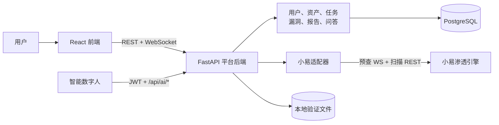
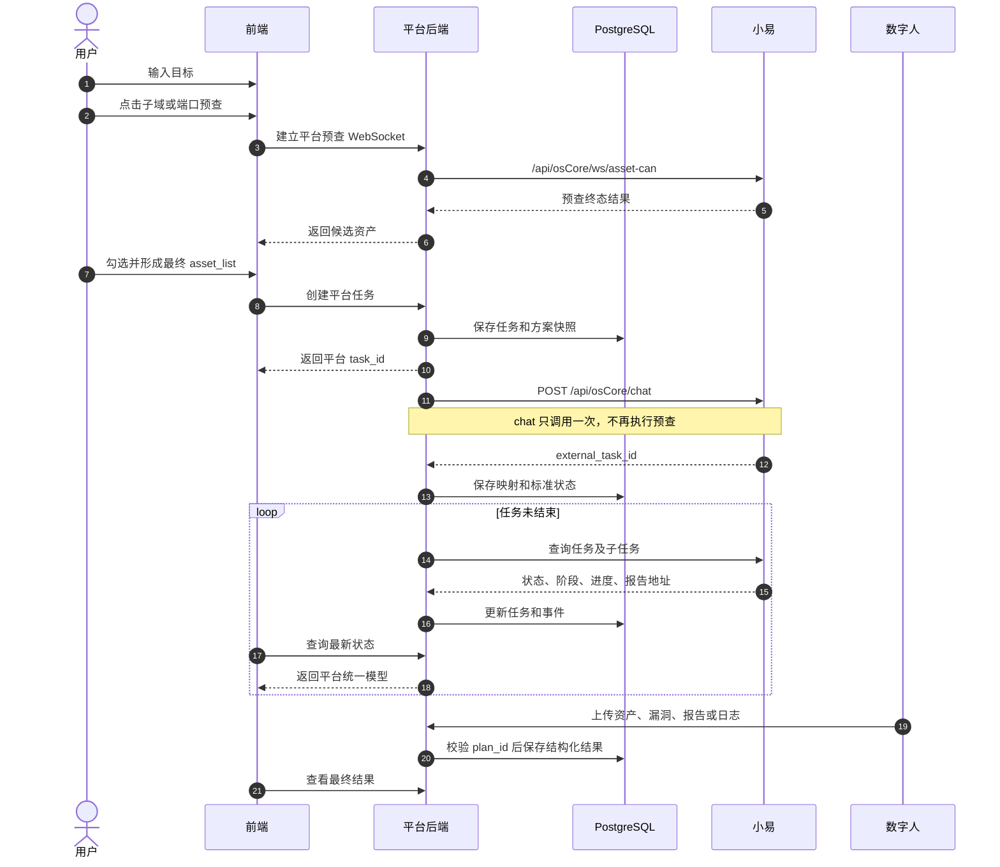

# AI 安服平台可验证模型——开发确认文档

| 项目 | 内容 |
| --- | --- |
| 版本 | v0.4 |
| 日期 | 2026-07-17 |
| 状态 | 待共同确认 |
| 本期目标 | 完成可运行、可演示、可验证的全系统闭环 |

> 这不是商用发布方案。本期用于确认产品流程、系统边界、小易接口和核心数据模型能否成立。

## 一、请先确认这 5 个结论

1. 本期交付的是全系统验证模型，不是单纯前端页面。
2. 平台负责业务、数据和任务编排；小易负责渗透计算，数字人负责分析和结果回传。
3. 前端只调用平台 API，不直接调用小易。
4. 本期完成一条真实扫描的端到端闭环，不追求商用级容量和高可用。
5. 采用模块化单体，暂不建设微服务、Redis 队列、MinIO 和 Kubernetes。

如果以上结论没有异议，再继续确认后面的接口和实施范围。

## 二、本期究竟要验证什么

### 必须跑通

```text
登录
  → 录入目标
  → 需求分析
  → WebSocket 子域/端口预查并勾选
  → 创建平台任务
  → 调用小易
  → 查看父子任务、阶段和进度
  → 停止或等待完成
  → 数字人回传资产、漏洞、报告和日志
  → 从历史任务重新查看
```

### 通过标准

| 验证项 | 通过条件 |
| --- | --- |
| 系统边界 | 浏览器全程只访问平台 API |
| 真实对接 | 至少一个已授权目标通过小易完成真实任务 |
| 状态同步 | 可显示任务状态、阶段、进度、父子任务和错误 |
| 结果沉淀 | 至少形成可回查的漏洞记录或报告记录 |
| 数字人对接 | 使用独立账号回传至少一条结构化结果 |
| 失败处理 | 参数错误、引擎不可用、任务停止有明确反馈 |
| 可重复演示 | 新环境按说明启动后可以重新完成上述流程 |

### 本期明确不做

- 商用级 SLA、高并发、多活、容灾和无停机升级。
- 微服务、Kubernetes、复杂事件总线和自动扩缩容。
- 企业 SSO、复杂多租户和细粒度数据权限。
- 完整合规审计中心、运营配置中心和旧数据全量迁移。
- 未被核心流程使用的提前抽象和通用平台能力。
- 4A 审计默认不进入黄金路径，除非本次评审明确要求。

## 三、新系统边界



### 谁负责什么

| 能力 | 平台负责 | 小易负责 |
| --- | --- | --- |
| 登录和角色 | 是 | 否 |
| 资产和扫描计划 | 是 | 否 |
| 需求分析与多轮确认 | 是 | 否 |
| 子域、端口探测 | 代理连接并管理勾选流程 | 执行 WebSocket 预查 |
| 扫描和漏洞验证 | 编排、展示、记录 | 执行计算 |
| 父子任务与进度 | 保存并标准化 | 提供原始状态 |
| 漏洞与报告 | 入库、查询、下载 | 生成原始结果 |
| 专家问答历史 | 保存上下文和历史 | 否 |

数字人是第三个参与方，不属于小易，也不是单纯的页面动画。它通过平台 JWT 登录，并调用 `/api/ai/*` 创建/启动计划或回传资产、漏洞、报告和日志。

边界规则：

- 平台生成自己的 `task_id`，小易 ID 只保存为 `external_task_id`。
- PostgreSQL 保存平台业务状态，小易是扫描执行状态来源。
- 小易字段必须先经过适配器转换，不能直接进入页面。
- 小易暂时不可用时，历史任务、漏洞和报告仍应可以查看。
- 资产预查 WebSocket 由平台代理，浏览器仍不直接暴露小易地址。
- 数字人使用独立平台账号；上传数据必须关联并校验 `plan_id`。

## 四、一次任务如何运行



验证阶段由 FastAPI 内的单实例后台循环同步任务。服务重启后，从 PostgreSQL 查询非终态任务并继续同步。

预查协议要点：

- 用户主动点击预查按钮；顺序固定为“子域 → 端口”。
- WebSocket 只发送 `action` 和目标，不发送用户、组织、白盒或扫描参数。
- 表单与最终 `/chat` 结构一致，只有 `asset_list` 从初始目标变为勾选结果。
- `scan_subdomain`、`scan_port`、`can_subdomain`、`can_port` 已废弃；最终 `/chat` 携带这些字段会返回 400。

## 五、技术栈

### 前端

| 技术 | 用途 |
| --- | --- |
| React + TypeScript + Vite | 页面和构建 |
| React Router | 路由 |
| Ant Design + CSS Variables | 后台组件和主题 |
| TanStack Query | 请求、缓存和轮询 |
| React Hook Form + Zod | 扫描计划表单 |
| ECharts | 总览和趋势图 |
| Vitest | 核心前端逻辑测试 |
| Playwright | 黄金路径测试 |

首期使用原生 `fetch`，不引入 Axios；没有明确跨页面客户端状态前，不引入 Zustand。

### 后端和运行环境

| 技术 | 用途 |
| --- | --- |
| Python 3.12 + FastAPI | 平台 API |
| FastAPI WebSocket | 代理小易资产预查连接 |
| Pydantic | 请求、响应和配置校验 |
| SQLAlchemy 2 + Alembic | 数据访问和迁移 |
| PostgreSQL 16 | 用户、资产、任务、漏洞和报告 |
| HTTPX + `websockets` | 小易 REST 与 WebSocket 适配 |
| PyJWT | 用户及数字人 JWT |
| `asyncio` 后台循环 | 提交和同步小易任务 |
| 本地受控目录 | 验证阶段保存附件和报告 |
| pytest | 后端和接口契约测试 |
| Docker Compose | 可重复启动演示环境 |

什么时候再升级：

- 需要多实例或任务吞吐不足时，再引入 Celery + Redis。
- 需要共享文件、生命周期管理时，再引入 MinIO/S3。
- 出现独立部署或独立扩容需求时，再考虑拆分服务。

## 六、旧架构与新方案对比

| 项目 | 旧架构 | 本期新方案 |
| --- | --- | --- |
| 后端 | Flask，业务与编排耦合 | FastAPI 模块化单体 |
| 智能体逻辑 | 集中在 `camel_agents.py` | 按需求分析、编排、问答分模块 |
| 数据 | SQLite / 本地文件 | PostgreSQL + 本地验证文件 |
| 引擎调用 | 业务代码中透传、补刷 | 统一小易适配器 |
| 资产预查 | `/chat` 同步预查或旧字段驱动 | 独立 WebSocket，用户按钮触发 |
| 任务 ID | 平台与小易边界不够清晰 | 平台 ID 与外部 ID 明确映射 |
| 状态 | 页面可能理解小易字段 | 后端统一状态和阶段 |
| 任务组 | 部分由前端逐项聚合 | 后端保存并聚合父子任务 |
| 权限 | 规则分散 | 最小登录和角色检查 |
| 报告 | 本地文件或小易 URL | 平台记录并受控下载 |
| 数字人 | AI 接口已存在但边界分散 | 独立 JWT 参与方，统一写入平台数据 |
| 部署目标 | 依赖旧运行环境 | Compose 可重复演示 |

### 继续沿用的旧设计

- 前端不直连小易。
- 建任务前必须完成需求分析和最终校验。
- 平台保留计划、任务和问答历史。
- 父任务、子任务和单目标范围必须真实对应。
- 专家问答历史与扫描执行时间线分开保存。

## 七、最小业务模块

| 模块 | 本期内容 |
| --- | --- |
| 用户 | 登录、退出、管理员和操作员 |
| 资产 | 新增、列表、基础校验 |
| 扫描计划 | 需求分析、确认项、计划快照 |
| 任务 | 创建、列表、详情、父子任务、停止 |
| 小易适配 | 请求转换、状态转换、超时和错误 |
| 预查代理 | 转发子域/端口 WebSocket 并返回终态结果 |
| 数字人接口 | 登录、创建/启动计划、上传资产/漏洞/报告/日志 |
| 漏洞 | 从结果生成记录、列表和详情 |
| 报告 | 保存元数据、下载或跳转 |
| 专家问答 | 任务内提问和历史 |
| 总览 | 使用真实任务数据展示核心指标 |
| 操作记录 | 记录创建、停止和处置等关键动作 |

核心数据实体：

```text
User → Asset → ScanPlan → Task → ChildTask
                         ├→ TaskEvent
                         ├→ Vulnerability
                         ├→ Report
                         └→ QAMessage
```

## 八、开发顺序

### 第 1 步：确认小易契约

- 确认测试地址、认证方式和授权扫描目标。
- 确认 WebSocket V1.4.2 为最新预查契约。
- 补齐工具结果、数字人结果归属和报告规则。
- 固定平台状态与小易状态映射。

### 第 2 步：搭建可运行骨架

- 创建前端、后端、PostgreSQL 和 Compose。
- 完成最小登录、布局、数据迁移和小易 Mock。

### 第 3 步：跑通真实任务

- 完成资产、扫描计划、确认链和任务创建。
- 完成平台到小易的预查 WebSocket 代理。
- 完成父子任务同步、进度展示、停止及失败反馈。
- 使用一个授权目标连接真实小易。

### 第 4 步：沉淀结果并验收

- 形成漏洞或报告记录。
- 使用数字人专用账号完成一次结构化数据回传。
- 完成任务历史、总览和基础专家问答。
- 运行黄金路径测试并记录验证结论。

## 九、开发前必须确认

带“阻塞”的事项没有结论前，不能完整实现渗透主链路。

| 编号 | 事项 | 建议 | 状态 |
| --- | --- | --- | --- |
| D01 | 平台边界 | 前端禁止直连小易 | 待确认 |
| D02 | 【阻塞】小易测试环境和认证 | 提供固定测试地址与凭据 | 待确认 |
| D03 | 【阻塞】授权扫描目标 | 提供至少一个可重复扫描目标 | 待确认 |
| D04 | 【阻塞】预查协议版本 | 以 WebSocket V1.4.2 为准，废弃 scan/can 字段 | 待确认 |
| D05 | 【阻塞】工具结果接口 | 小易补充正式契约和示例 | 待确认 |
| D06 | 【阻塞】结构化结果生产方 | 确认由数字人调用 `/api/ai/*` 回传 | 待确认 |
| D07 | 【阻塞】报告 URL 规则 | 明确权限、格式和有效期 | 待确认 |
| D08 | 任务同步 | 单实例后台轮询 | 待确认 |
| D09 | 验证角色 | 管理员、操作员 | 待确认 |
| D10 | 4A 审计 | 默认不进入本期黄金路径 | 待确认 |
| D11 | 数字人身份 | 使用独立账号；确认 JWT claims、刷新与保管方式 | 待确认 |

## 十、已知风险

1. 旧 `/chat` 文档仍包含同步预查和 `scan_*` 字段，与 WebSocket V1.4.2 冲突，必须确认版本优先级。
2. 当前小易 API 文档没有定义旧架构中使用的 `/tools` 接口。
3. 小易没有结构化漏洞接口；当前方案依赖数字人 `/api/ai/upload-vulnerability` 回传，需要确认实际生产方。
4. 数字人文档允许 `plan_id` 为空，但验证模型应要求结果必须关联有效计划，避免孤立数据。
5. 数字人文档使用共享登录密码换取 HS256 JWT；验证时使用独立账号，凭据不得写入前端或仓库。
6. `reportUrl` 示例是内网 HTTP 地址；数字人又允许上传任意 URL，需要明确展示和下载策略。
7. 单实例同步器和 WebSocket 代理适合验证，不适合未来多实例生产部署。

## 十一、评审结论

评审结果：`通过 / 有条件通过 / 退回修改`

| 角色 | 姓名 | 结论或意见 |
| --- | --- | --- |
| 产品负责人 |  |  |
| 技术负责人 |  |  |
| 前端负责人 |  |  |
| 后端负责人 |  |  |
| 小易引擎负责人 |  |  |
| 测试负责人 |  |  |

本版新增参考：

- `WebSocket对接设计方案.md`（资产预查 V1.4.2，2026-06-12）
- `数字人对接文档.md`

详细设计、完整数据模型和安全清单见：

[AI安服平台开发架构确认文档（详细版）](./AI安服平台-开发架构确认文档-详细版.md)
