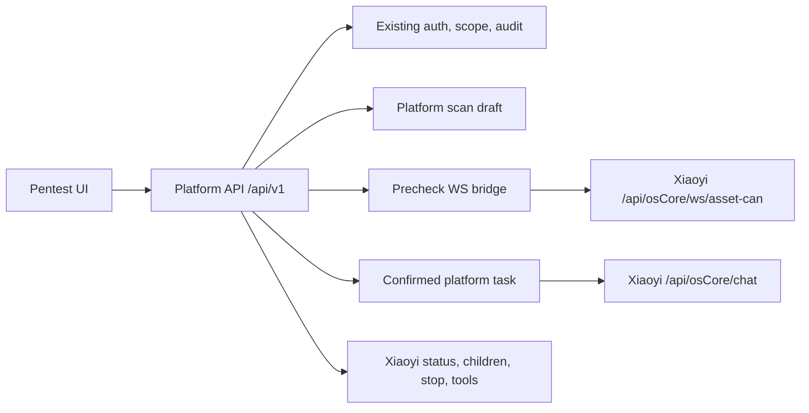

# Xiaoyi Core Path Design

Date: 2026-07-23

## Goal

Connect the platform's existing authorized pentest flow to Xiaoyi's documented core path while keeping the current architecture, UI shell, auth boundary, audit behavior, and design assets intact.

The first implementation scope is the Xiaoyi core scan path:

- Local form and authorization stay in the platform.
- Precheck uses Xiaoyi WebSocket `/api/osCore/ws/asset-can`.
- Final task creation calls Xiaoyi `/api/osCore/chat` exactly once per confirmed platform task.
- Task status, child tasks, stop, and tools are exposed through the current `/api/v1/*` platform API.

Out of scope for this spec:

- Settings page frontend.
- New microservices.
- New unconfirmed runtime dependencies.
- Full analyze-intent, expert QA/history, summary, and 4A integration. These require separate follow-up specs.

## Source Of Truth

The four reference documents placed beside the repository are authoritative for Xiaoyi and aiscanner behavior:

- `WebSocket对接设计方案.md`
- `数字人对接文档.md`
- `xiaoyi对接流程图.md`
- `aiscanner工作流程图.md`

When code and these documents disagree, implementation should follow the documents unless doing so would violate platform safety or authorization boundaries. Any such conflict must be reported before expanding scope.

## Architecture

The platform remains the integration boundary. The browser never receives Xiaoyi credentials and never talks directly to Xiaoyi.



The platform draft may be created before precheck, but no Xiaoyi `/api/osCore/chat` request may be sent before the user confirms the plan. Confirmation freezes the payload used for Xiaoyi chat.

## Components

### Backend Xiaoyi Client

`apps/api/app/engine.py` remains the Xiaoyi adapter location.

Required behavior:

- `create_task` sends the final frozen payload to `POST /api/osCore/chat`.
- Every chat request carries a stable platform `request_id` for idempotency and traceability.
- Deprecated `can_*` and `scan_*` fields must be rejected before the request leaves the platform.
- `precheck` must support Xiaoyi WebSocket actions without inventing undocumented payload fields.
- Task status, child task, stop, and tools calls must parse Xiaoyi responses defensively and normalize them to current platform schemas.

### Backend Platform API

`apps/api/app/main.py` keeps the public platform routes.

Required behavior:

- `/api/v1/prechecks/ws` bridges one browser WebSocket session to one upstream Xiaoyi WebSocket session.
- Draft updates are allowed only while the plan is still `DRAFT`.
- Plan confirmation freezes form fields and normalized assets.
- Task creation rejects unconfirmed plans, empty `asset_list`, unauthorized assets, or snapshots containing deprecated fields.
- Existing platform auth, organization ownership, audit logging, and sync jobs stay in place.

### Schemas

`apps/api/app/schemas.py` must match the Xiaoyi document while preserving the platform API shape.

Required behavior:

- Domain precheck payload sent upstream:

```json
{"action":"can_subdomain","domains":["example.com"]}
```

- Port precheck payload sent upstream:

```json
{"action":"can_port","hosts":[{"host":"example.com","hostType":"domain"}]}
```

- `hostType` is required when sending port precheck upstream and must be either `domain` or `ip`.
- Final `asset_list` is normalized and deduplicated before confirmation and before chat dispatch.

### Frontend Core Flow

The settings page remains deferred. Existing frontend work should only change the scan flow required to call the backend correctly.

Required behavior:

- The browser opens one platform precheck WebSocket for the active precheck session.
- Subdomain precheck runs before port precheck.
- Selected or accepted precheck results are saved back to the draft asset list before confirmation.
- Direct/no-precheck asset entry is still allowed, but it must pass the same backend validation.
- Confirmation is explicit. After confirmation, changes require a new draft.

## Data Flow

1. User completes the local platform scan form.
2. Platform creates or updates a local `DRAFT` scan plan. This is not a Xiaoyi chat request.
3. User runs optional subdomain precheck through `/api/v1/prechecks/ws`.
4. Platform forwards the documented `can_subdomain` message to Xiaoyi over the active upstream WebSocket.
5. User accepts or selects discovered domains.
6. User runs optional port precheck for selected domains or direct assets.
7. Platform forwards the documented `can_port` message, including `hostType`.
8. Platform saves accepted assets back to the draft.
9. User confirms the plan.
10. Platform freezes form fields and assets into a task snapshot.
11. Platform creates the scan task and sends exactly one `POST /api/osCore/chat`.
12. Platform syncs task status, child tasks, tools, and stop behavior through existing backend routes.

The final Xiaoyi chat payload must preserve platform form fields that the reference docs require or imply, including:

- `org_id`
- `user_id`
- `plan_id`
- `scan_mode`
- `scan_speed`
- normalized `asset_list`
- stable `request_id`

Platform stable string identifiers are passed through directly. This phase does not introduce a new external identity mapping table.

## Error Handling

WebSocket errors are normalized into platform messages that the UI can render consistently.

Required behavior:

- Browser disconnect closes the upstream Xiaoyi WebSocket.
- Ping/pong keeps the bridge alive while Xiaoyi supports it.
- If a precheck action fails, the platform keeps previously accepted results and reports the failing action.
- If Xiaoyi returns malformed data, the platform rejects that action response instead of silently mutating the draft.
- If `/api/osCore/chat` times out or returns 5xx, the platform task is marked as failed or pending retry according to the existing task model. The platform must not report fake success.
- Retry of chat dispatch uses the same platform `request_id`.
- Logs and API errors must not expose Xiaoyi API keys.

## Safety Rules

The implementation must not expand scan authority.

Required checks:

- The current user's organization must own the plan and assets before precheck result persistence, confirmation, or task creation.
- Empty `asset_list` is rejected before task creation.
- Deprecated Xiaoyi fields are rejected recursively in the final task snapshot.
- Precheck and task creation must not bypass the existing authorization logic.
- Live smoke tests may verify connectivity and schema behavior only. Do not start unauthorized scans against external assets.

## Testing Strategy

Backend contract tests:

- Validate Xiaoyi precheck payloads for `can_subdomain` and `can_port`.
- Validate `hostType` handling for domain and IP hosts.
- Validate draft-only asset updates.
- Validate confirmation freezes the snapshot.
- Validate final chat is called once and only after confirmation.
- Validate deprecated fields are rejected recursively.
- Validate tools, status, children, and stop response normalization.

WebSocket integration tests:

- One browser WebSocket maps to one upstream Xiaoyi WebSocket.
- Multiple precheck actions can reuse the active upstream session.
- Disconnect closes the upstream session.
- Upstream error messages are normalized.

Frontend tests:

- Precheck WebSocket lifecycle does not open a new platform socket for every action in one session.
- Accepted subdomain and port candidates update the draft before confirmation.
- Direct/no-precheck assets still work.
- Confirmation prevents mutation of the frozen plan.

Regression and smoke:

- Run the existing backend and frontend test suites.
- Run a non-destructive live smoke against the configured Xiaoyi endpoint only for health, model, and protocol checks.
- If the live Xiaoyi host still returns 502, report it as an upstream blocker with evidence and keep local tests as the release gate.

## Acceptance Criteria

- The platform can complete the local form to precheck to confirm to task flow without sending Xiaoyi deprecated fields.
- Xiaoyi receives no `/api/osCore/chat` call until platform confirmation.
- A confirmed task sends exactly one chat request for the frozen snapshot.
- The final asset list reflects accepted precheck results or direct user-entered assets.
- Existing auth, audit, task sync, and UI structure remain intact.
- Backend and frontend tests pass.
- Live smoke either succeeds without starting an unauthorized scan or records a clear upstream blocker.
