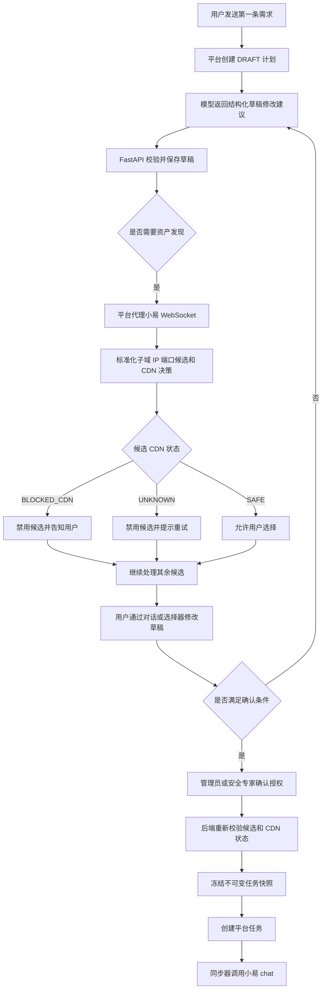

# 对话式扫描计划、资产发现与 CDN 拦截设计

> 2026-07-29 实施补充：用户已确认采用 CAMEL-AI Python + DeepSeek 组成单一“需求分析智能体”，并由平台使用其提供的 `cdninfo` CLI 独立判断 CDN/WAF。凡下文仍写“小易返回 CDN 判断”或“不新增 CDN 工具”，均以本补充为准：小易只接收平台经 `cdninfo` 清洗后明确为 `SAFE` 的资产；`cdninfo` 缺失、超时、失败或字段不明确均设为 `UNKNOWN` 并阻断。工具与数据库通过只读目录挂载，不提交 Git、不打入应用镜像。

## 1. 目标

在现有 AI 安服平台验证模型内增加一条可验证的开扫前工作流：用户通过持续对话创建和修改扫描计划草稿；只有域名的客户可以先执行资产发现，再从候选域名、IP 和端口中选择最终资产；检测为 CDN 的资产必须告知用户并禁止开扫。

本设计保持现有 React + FastAPI + PostgreSQL 模块化单体，不新增微服务、队列、缓存或未确认依赖。小易继续只负责资产预查和渗透计算，平台负责对话、草稿、授权、选择和安全拦截。

## 2. 已确认产品规则

1. 对话只允许修改 `DRAFT` 扫描计划。
2. 对话模型不能创建或启动小易任务；开扫必须经过独立的用户确认动作。
3. 用户可以在开扫前通过对话增删资产、修改测试类型、扫描速度和白盒说明。
4. 用户只有域名时，可以依次执行子域发现和端口发现，并从平台候选列表中选择最终资产。
5. 识别为 CDN 的资产显示阻断原因、不可选择、不可进入最终任务快照，也不能通过篡改前端请求绕过。
6. 多资产计划中只阻断 CDN 资产，其余明确安全的资产仍可选择和开扫。
7. CDN 状态无法确认时采用安全失败：该资产不可开扫，并提示用户重试资产发现。
8. 计划确认后生成不可变快照；需要修改已确认或运行中的任务时创建新计划，不修改原任务。

## 3. 系统边界

### 3.1 平台负责

- 保存计划级对话历史和结构化草稿状态。
- 调用 OpenAI-compatible 模型解析用户意图；首选现有环境提供的 DeepSeek 配置。
- 对模型返回的结构化修改做类型、范围、权限和状态校验。
- 代理小易资产预查 WebSocket，并将上游数据标准化为资产候选。
- 保存候选的来源关系、选择状态和 CDN 决策。
- 在计划确认和任务创建两个边界重复执行 CDN 与授权校验。
- 对浏览器隐藏模型密钥、小易密钥和上游原始内部错误。

### 3.2 小易负责

- `WS /api/osCore/ws/asset-can` 子域与端口预查。
- 返回明确的资产发现结果及 CDN/WAF 判断；平台不使用大模型猜测 CDN。
- `POST /api/osCore/chat` 创建最终自动渗透任务。
- 任务、子任务、工具结果和停止接口维持现有职责。

### 3.3 明确不做

- 不把小易 `/chat` 当作持续对话接口。
- 不新增 DNS 扫描器、端口扫描器、CDN 情报服务或第三方资产测绘服务。
- 不允许 AI 自动授权资产、自动确认计划或自动开扫。
- 不修改设置页前端。
- 不支持运行中任务原地变更资产。

## 4. 端到端流程



## 5. 对话契约

### 5.1 创建对话草稿

`POST /api/v1/scan-plan-dialogs`

请求：

```json
{
  "message": "对 example.com 做标准测试，先发现资产，不要立即开扫"
}
```

成功响应包含：

```json
{
  "plan": {},
  "user_message": {},
  "assistant_message": {},
  "proposed_changes": {},
  "required_actions": ["ASSET_DISCOVERY", "ASSET_SELECTION", "AUTHORIZATION"]
}
```

第一条消息只创建 `DRAFT` 计划。模型无法提供有效目标时仍保存消息，但计划保持不可确认状态，并返回需要补充目标的提示。

### 5.2 继续对话

- `GET /api/v1/scan-plans/{plan_id}/messages`：按创建时间返回计划对话历史。
- `POST /api/v1/scan-plans/{plan_id}/messages`：追加用户消息、调用模型、保存助手回复和经过校验的草稿变更。

计划不是 `DRAFT` 时，追加消息返回 `409 PLAN_NOT_DRAFT`。浏览器重试必须携带 `request_id`；相同计划、用户和 `request_id` 返回原结果，不能重复应用草稿修改。

### 5.3 模型结构化输出

模型只能返回以下受控结构：

```json
{
  "assistant_message": "已将扫描速度改为标准，等待资产发现。",
  "plan_patch": {
    "name": "example.com 自动渗透",
    "test_type": "standard",
    "scan_speed": "standard",
    "add_targets": ["example.com"],
    "remove_targets": [],
    "whitebox_context": ""
  },
  "requested_actions": ["ASSET_DISCOVERY"]
}
```

允许的枚举：

- `test_type`: `discovery`、`standard`
- `scan_speed`: `quick`、`standard`
- `requested_actions`: `ASSET_DISCOVERY`、`ASSET_SELECTION`、`AUTHORIZATION`

模型返回 JSON 以 Pydantic 校验；额外字段、非法地址、越界长度和未知动作全部拒绝。拒绝模型输出时保存一条安全的助手提示，不改变原草稿。

## 6. 资产候选与 CDN 状态

### 6.1 标准候选结构

每个候选资产包含：

```json
{
  "candidate_id": "uuid",
  "source_target": "example.com",
  "asset_type": "domain",
  "address": "www.example.com",
  "port": null,
  "service": null,
  "cdn_status": "SAFE",
  "selectable": true,
  "selected": false,
  "blocked_reason": null
}
```

`cdn_status` 只能是：

- `PENDING`：尚未完成判断，不可选择。
- `SAFE`：上游明确返回非 CDN，可选择。
- `BLOCKED_CDN`：上游明确识别为 CDN，不可选择。
- `UNKNOWN`：响应缺少明确判断或格式无法识别，不可选择。
- `NOT_APPLICABLE`：用户直接提供且经过授权的 IP；没有域名来源关系。本期不增加 IP ASN/CDN 情报判断。

由域名发现出的 IP、端口和子域必须保留 `source_target`。一旦源域名为 `BLOCKED_CDN`，所有派生候选都继承阻断，禁止写入最终 `asset_list`。

### 6.2 上游判断边界

平台只接受小易响应中的明确布尔值或明确枚举作为 CDN 证据。响应未提供明确结论时不得根据域名、IP、助手文本或端口结果猜测，统一设为 `UNKNOWN`。

当前参考文档说明小易在端口预查前执行 CDN/WAF 检测，但没有冻结返回字段。因此真实环境能否得到 `SAFE` 或 `BLOCKED_CDN` 是上线前契约验收项；在该字段确认前，相关域名会安全阻断而不是误扫 CDN IP。

### 6.3 选择和确认

- `PATCH /api/v1/scan-plans/{plan_id}/assets` 接受 `candidate_id` 列表，不再相信浏览器提交的任意资产字典。
- 后端只将属于当前组织、当前计划、`SAFE` 或允许的 `NOT_APPLICABLE` 候选写入草稿 `asset_list`。
- 至少存在一个已选择、已授权、未阻断资产才允许确认计划。
- 确认时使用数据库行锁，重新读取最新候选状态，避免预查和确认并发绕过。
- 任务创建时再次检查冻结快照中不存在 `BLOCKED_CDN`、`UNKNOWN` 或 `PENDING` 来源。

## 7. 数据模型

新增 `scan_plan_messages`：

- `id` UUID 主键
- `org_id`、`plan_id`、`created_by` 外键和索引
- `role`：`user` 或 `assistant`
- `content`：受长度限制的文本
- `request_id`：用户消息幂等键；助手消息为空
- `structured_delta`：经过校验并实际应用的变更
- `created_at`
- 唯一约束：`(plan_id, created_by, request_id)`，仅用户消息要求非空

扩展 `scan_plans`：

- `dialog_state` JSON：扫描速度、白盒摘要和待处理动作
- `discovery_state` JSON：候选资产、预查批次和最后错误

现有 `snapshot` 继续只在确认时冻结。迁移只添加表和 JSON 列，不修改既有任务快照，不自动确认历史计划。

## 8. 模型接入

配置只从环境读取：

- `OPENAI_API_BASE_URL`
- `API_KEY`
- `MODEL_TYPE`
- `LLM_TIMEOUT_SECONDS`

使用项目已有 `httpx` 调用 OpenAI-compatible Chat Completions，不引入新的 SDK。日志只记录请求 ID、耗时、模型名和结果分类；不记录 API Key、完整白盒信息或完整模型原始响应。

模型不可用时返回 `503 PLAN_ASSISTANT_UNAVAILABLE`，原草稿不变，用户可以继续使用结构化表单和资产选择器完成流程。

## 9. 前端行为

在现有 `PentestPage` 内增加持续对话区域，不修改设置页：

- 首次消息创建草稿，并保存返回的 `plan_id`。
- 后续消息沿用同一计划，刷新后从历史接口恢复。
- 每次助手回复同时展示已应用的结构化变更摘要。
- 资产发现结果按输入目标分组，展示类型、地址、端口、服务和 CDN 状态。
- CDN资产显示“检测到 CDN，已禁止扫描”；未知状态显示“CDN 状态未确认，请重试资产发现”。
- 禁用受阻候选的选择框，不提供强制扫描入口。
- 非 CDN 候选由用户选择；确认按钮展示最终资产数量和阻断数量。
- 最终确认仍要求管理员或安全专家，并使用现有计划确认与任务创建入口。

## 10. 错误与安全处理

- 小易预查断线：保存本轮失败，候选保持 `UNKNOWN`，允许用户重试，不自动降级为可扫描。
- 模型响应非法：不应用修改，返回安全提示，不暴露原始响应。
- 并发对话：使用计划行锁串行应用草稿变更；过期客户端重新读取计划。
- 重复消息：依赖 `request_id` 幂等返回，不重复调用模型或应用变更。
- CDN绕过：资产选择、计划确认、任务创建三层校验。
- 授权绕过：CDN安全不代表资产授权；两个条件必须同时满足。
- 敏感信息：白盒内容不回显到日志，不发送给小易预查，只有最终确认后的任务请求按现有契约提交。

## 11. 测试与验收

### 11.1 后端单元与集成测试

- 第一条消息创建 DRAFT 计划和两条消息记录。
- 同一计划连续消息按顺序修改草稿，并能从数据库恢复历史。
- 非 DRAFT 计划拒绝继续对话。
- 非法模型 JSON、未知字段和模型超时不修改草稿。
- 重复 `request_id` 不重复应用修改。
- 只有域名的计划能接收资产候选并等待用户选择。
- `BLOCKED_CDN` 和 `UNKNOWN` 候选不可选择。
- CDN源域名的派生 IP 和端口继承阻断。
- 混合资产只阻断 CDN 候选，其余 `SAFE` 候选可确认。
- 篡改请求直接提交 CDN 候选时返回 409。
- 确认与预查并发时，行锁后的最新 CDN 状态决定结果。
- 任务创建拒绝包含任何阻断或未确认资产的快照。
- 模型和小易凭据不出现在日志、API错误和持久化原始数据中。

### 11.2 前端测试

- 首次与后续消息使用同一 `plan_id`。
- 页面刷新后恢复对话历史和资产候选。
- CDN及未知候选不可选且显示明确原因。
- 多资产场景允许选择非 CDN 候选。
- 没有可扫描资产时确认按钮禁用。
- 模型不可用时用户仍可通过现有结构化表单继续。

### 11.3 真实环境验收

1. 使用小易方提供的授权测试域名验证明确非 CDN 返回字段。
2. 使用小易方提供的授权 CDN 测试域名验证阻断字段；不得自行扫描公共 CDN 域名。
3. 验证 CDN候选及其派生 IP 从未进入 `/api/osCore/chat` 请求体。
4. 使用至少一个非 CDN 授权候选完成任务创建、状态同步、漏洞或报告回查。
5. 真实验收前必须由小易方确认 CDN 字段名、枚举和语义。

## 12. 完成标准

- 用户可持续对话并修改同一 DRAFT 计划。
- 仅有域名时可执行资产发现并选择候选。
- CDN和未知候选在前端、后端确认及任务创建三个边界均不可开扫。
- 多资产计划中其余安全资产可继续。
- 确认后的快照不可变且不包含受阻候选。
- Mock契约、数据库迁移、前后端测试和构建通过。
- 真实小易 CDN字段未确认时系统保持安全阻断，并明确报告该外部契约阻塞。
